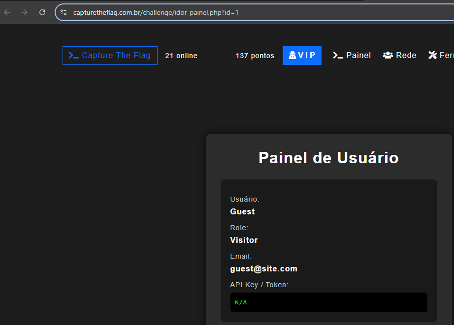
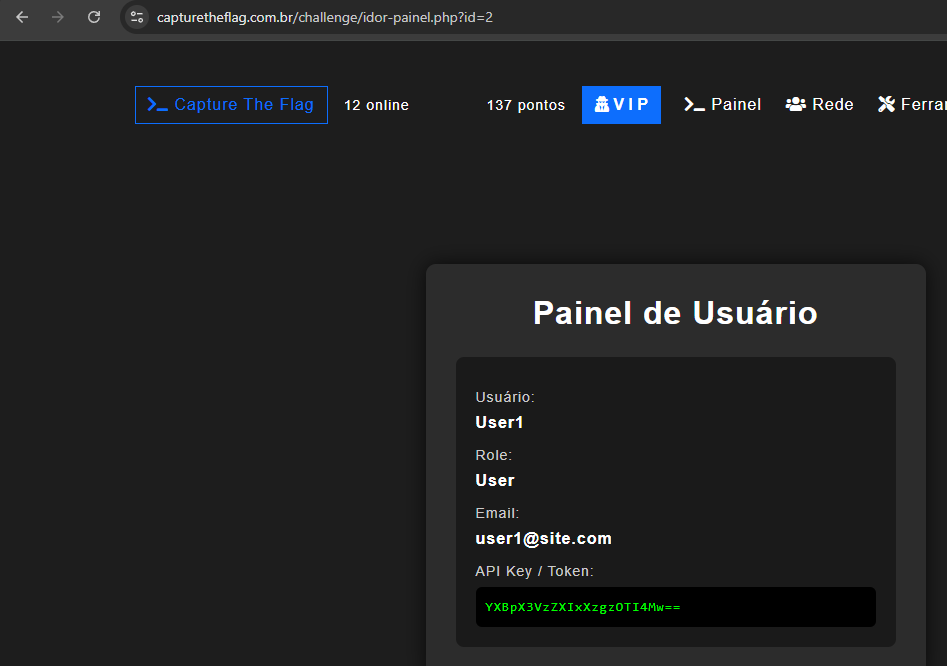
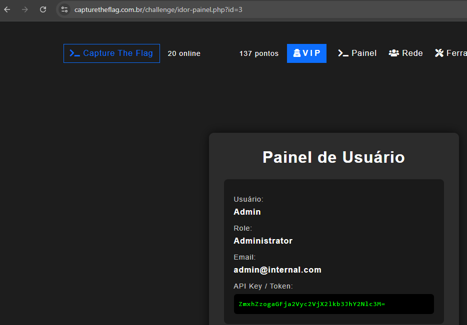

# Solução do Desafio — IDOR

**Ferramentas:** navegador e terminal do kali linux(base64, curl opcional)  
**Ambiente:** Laboratório (HackerSec)  

## Resumo rápido
Achei um token/API key exposto ao alterar o parâmetro `id` na URL. O token retornado estava em Base64; decodificando obtive: `hackersec_idoraccess`.

---

## Passo a passo (reproduzível)

1. **Acessar a página do desafio**  
   - Abri a URL do lab no navegador `https://capturetheflag.com.br/challenge/idor-painel.php?id=1`

2. **Analisar o parâmetro na URL**  
   - Notei o parâmetro `?id=1` que controla qual perfil é exibido.

3. **Testar manipulação do parâmetro**  
   - Substituí `id=1` por `id=2` — página mudou, continuei testando.  
   - Substituí por `id=3` e a resposta exibiu um token codificado.

4. **Trecho exibido (lab)**  
   - A página mostrou:
   ```html
   API Key / Token:
   ZmxhZzogaGFja2Vyc2VjX2lkb3JhY2Nlc3M=
    ```
## Sequencia das Evidências visuais 
### id=1

### id=2

### id-3



