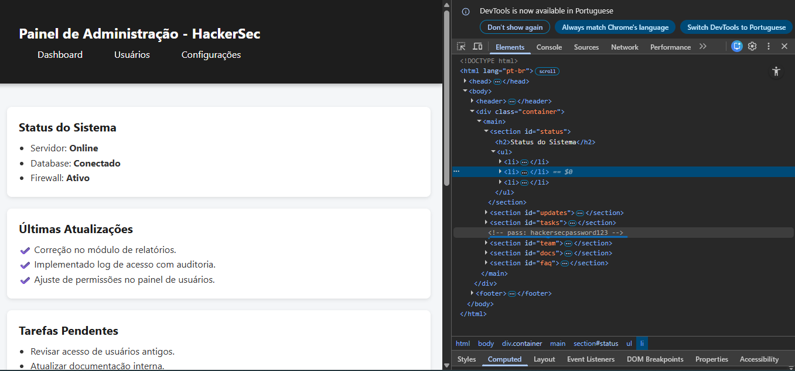

> ⚠️ Este desafio foi realizado em ambiente de laboratório (HackerSec). Todos os dados são fictícios.

# Solução do Desafio — Password  

## Passo a passo da solução

1. **Acessar a página do desafio**  
   - Entrei na URL fornecida no lab HackerSec.  

2. **Abrir o código-fonte / inspecionar elementos**  
   - Cliquei com o botão direito na página e depois fui em **“Inspecionar”** ou use o atalho (**F12** / **Ctrl+Shift+I**).  
   - No painel **Elements**, procure por **comentários HTML**, que seguem o formato:
     ```html
     <!-- ... -->
     ```
   - Localizei um comentário contendo a senha exposta:
     ```html
     <!-- dev-note: pass: hackersecpassword123 -->
     ```


5. **Resultado final**
   - Senha encontrada: `hackersecpassword123`

---

## Conclusão
Esse desafio demonstra o risco de deixar informações sensíveis no código-fonte, mesmo dentro de comentários.  
No contexto do laboratório, o objetivo é treinar inspeção e análise rápida de exposição de dados.

### Evidência visual

