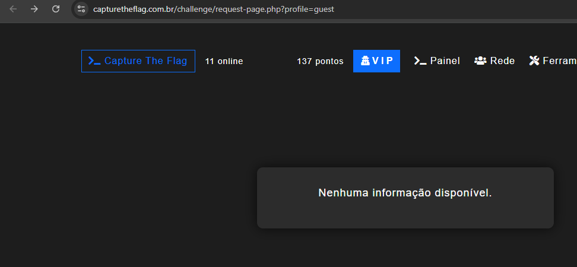
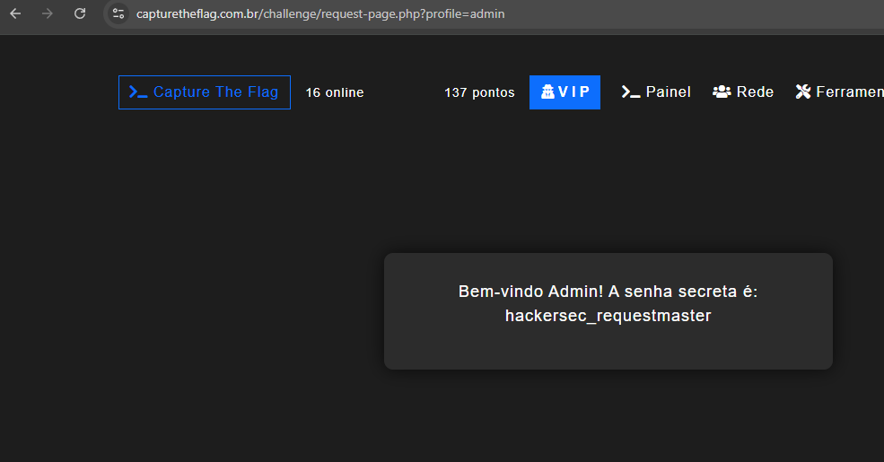

# Solução — 03 Request 

**Ferramentas:** navegador (Url)  
**Ambiente:** Laboratório (HackerSec)

## Resumo rápido
Ao manipular o parâmetro da URL que referencia o perfil, foi possível visualizar conteúdo de outro usuário sem autorização. Resultado observado no lab: senha exibida para o admin — `hackersec_requestmaster`.

---

## Passo a passo (reproduzível)

1. **Acessar a página do desafio**  
   - Abrir a URL do lab no navegador `https://capturetheflag.com.br/challenge/request-page.php?profile=guest`.

2. **Inspecionar a URL / parâmetros**  
   - Notei que a URL continha um parâmetro simples que referenciava o perfil: `?profile=guest`.

3. **Testar manipulação do parâmetro**  
   - Troquei `guest` por `admin` e voltei a carregar a página.

4. **Confirmação via navegador**  
   - A página retornou conteúdo de administrador. Exemplo do trecho exibido (lab):
   ```html
   <pre>Bem-vindo Admin! A senha secreta é: hackersec_requestmaster</pre>
   ```

## Evidência visual: 
### Antes (profile=guest)


### Depois (profile=admin)


