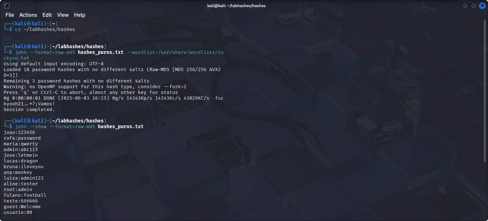

> ⚠️ **Aviso Importante**  
> Este projeto é **estritamente educacional**.  
> Todas as senhas, hashes e usuários apresentados são **fictícios** e foram criados apenas para fins de **demonstração**.  
> **Não incentive, pratique ou realize qualquer atividade maliciosa** com base nestas informações.

# 🔥 QUEBRA DE HASHES MD5

## 📂 Sobre
Ataque de quebra de hashes no algoritmo MD5, utilizando o John The Ripper + RockYou.txt.  
O objetivo é demonstrar, na prática, a fragilidade do MD5 na quebra de senhas.

## ⚙️ TECNOLOGIA USADA
🐍 Kali Linux  
🛠️ John The Ripper  
📜 Wordlist: RockYou.txt  

## 🚀 O QUE FOI FEITO
- Coleta de hashes MD5 (raw-md5).  
- Execução de ataque de dicionário com John The Ripper.  
- Quebra de senhas fracas em segundos.  
- **O arquivo `hashes_puros.txt` está na própria pasta deste projeto.**  

## 📸 EVIDÊNCIA

## 🏆 Resultado
| Usuário | Senha    |
|---------|----------|
| joao    | 123456   |
| rafa    | password |
| maria   | qwerty   |
| admin   | abc123   |
| jose    | letmein  |
| lucas   | dragon   |
| brunna  | iloveyou |
| marcos  | monkey   |
| luiza   | admin123 |
| root    | 123456   |
| teste   | football |
| teste2  | 666666   |
| guest   | welcome  |
| usuario | 00       |