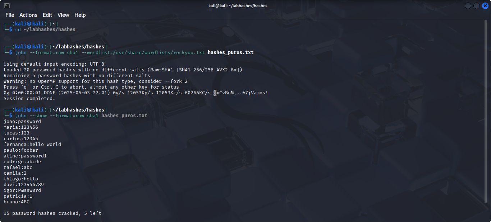

> ⚠️ **Aviso Importante**  
> Este projeto é **estritamente educacional**.  
> Todas as senhas, hashes e usuários apresentados são **fictícios** e foram criados apenas para fins de **demonstração**.  
> **Não incentive, pratique ou realize qualquer atividade maliciosa** com base nestas informações.

# 🔥 QUEBRA DE HASHES SHA1

## 📂 Sobre
Ataque de quebra de hashes usando o algoritmo **SHA1**, aplicando **John The Ripper** com a wordlist **rockyou.txt**.  
O objetivo é demonstrar, na prática, como senhas fracas podem ser quebradas mesmo com um algoritmo mais robusto que MD5 — reforçando a importância de boas práticas de segurança.

## ⚙️ TECNOLOGIA USADA
🐍 Kali Linux  
🛠️ John The Ripper  
📜 Wordlist: RockYou.txt  

## 🚀 O QUE FOI FEITO
- Coleta e estruturação de hashes SHA1 (`raw-sha1`) no formato `usuario:hash`.  
- Execução de ataque de dicionário com o John.  
- Senhas fracas quebradas em segundos, demonstrando que SHA1 ≠ segurança garantida.  
- **O arquivo `hashes_puros.txt` está incluído neste projeto.**

## 📸 EVIDÊNCIA

## 🏆 Resultado
| Usuário  | Senha       |
|----------|-------------|
| joao     | password    |
| maria    | 123456      |
| lucas    | 123         |
| carlos   | 12345       |
| fernanda | hello world |
| paulo    | foobar      |
| aline    | password1   |
| rodrigo  | abcde       |
| rafael   | abc         |
| camila   | 2           |
| thiago   | hello       |
| davi     | 123456789   |
| igor     | P@ssw0rd    |
| patricia | 1           |
| bruno    | ABC         |

> **Moral da história:** nem SHA1 segura senhas fracas. Use senhas longas, aleatórias e, de preferência, bcrypt, scrypt ou Argon2!
