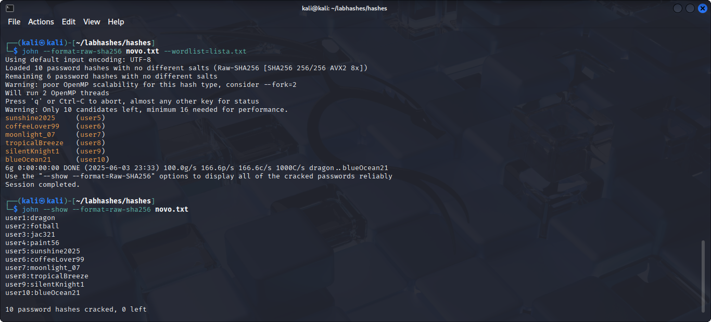

> ⚠️ **Aviso Importante**  
> Este projeto é **estritamente educacional**.  
> Todas as senhas, hashes e usuários apresentados são **fictícios** e foram criados apenas para fins de **demonstração**.  
> **Não incentive, pratique ou realize qualquer atividade maliciosa** com base nestas informações.

# 🔥 QUEBRA DE HASHES SHA256

## 📂 Sobre
Projeto prático que demonstra a quebra de hashes usando o algoritmo **SHA256**, um dos mais robustos algoritmos de hash disponíveis.  
Aqui, a pegada é mostrar que, mesmo com algoritmos fortes, senhas fracas ou comuns ainda são vulneráveis — desde que você tenha uma wordlist matadora.  

## ⚙️ TECNOLOGIAS USADAS
🐍 Kali Linux  
🛠️ John The Ripper  
📜 Wordlist personalizada criada do zero (não apenas a rockyou.txt)  
🔐 Lista de hashes SHA256 no formato `usuario:hash`  

## 🚀 O QUE FOI FEITO
- Geração de uma **wordlist personalizada**, com senhas normais e plausíveis, focada em aumentar a chance de quebrar hashes SHA256.  
- Estruturação do arquivo de hashes no formato `usuario:hash`, para facilitar a identificação do usuário após o ataque.  
- Execução do ataque de dicionário com John The Ripper usando essa wordlist customizada.  
- Quebra de senhas comuns demonstrando que a segurança depende muito da complexidade da senha, não só do algoritmo.  

## 📸 EVIDÊNCIAS  
  

## 🏆 RESULTADO  
| Usuário  | Senha          |  
|----------|----------------|  
| user1    | dragon         |  
| user2    | fotball        |  
| user3    | jac321         |  
| user4    | paint56        |  
| user5    | sunshine2025   |  
| user6    | coffeeLover99  |  
| user7    | moonlight_07   |  
| user8    | tropicalBreeze |  
| user9    | silentKnight1  |  
| user10   | blueOcean21    |  

